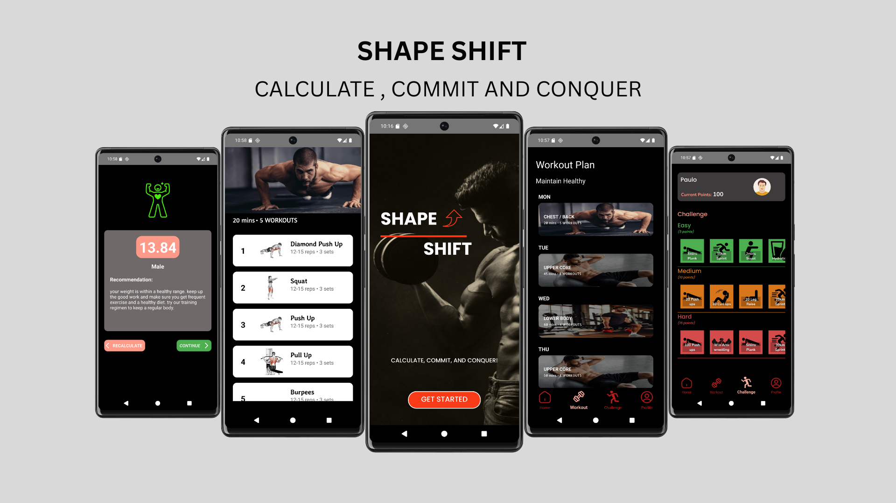

# Shape-Shift

Shape-Shift is an AI-assisted fitness app designed to help users stay consistent with their workouts, track their progress, and follow guided exercise routines. Whether you're a beginner or a seasoned athlete, Shape-Shift adapts to your goals and keeps you moving.

---

## Collaborators

- Jay Tinosa  
- Jamir Campos  
- Paulo Faustiniel Angelo Francisco  
- Jun Daniel Quindao  
- Joseph Rojas  
- Mateo Penit Jr.

---

## Features

- 🏋️ Guided workout routines  
- 🧠 AI-generated workout suggestions  
- 📊 Progress tracking and statistics  
- 🔔 Daily workout reminders  
- 🎯 Personalized goals and achievements  
- 🔐 Login and account system  

---

## Getting Started

### Prerequisites

- Android Studio  
- Android device or emulator  
- (Optional) Firebase account for login and tracking features

---

## Usage

1. Sign up or log in to access personalized workouts.  
2. Follow daily routines or let the AI suggest exercises based on your progress.  
3. Track your stats and see improvements over time.  
4. Customize your workout goals and get reminders to stay consistent.

---

## License

This project is licensed under the propriety License. See the [LICENSE](./LICENSE.txt) file for more information.

---

## Contact

For feedback or inquiries, reach out at [francisco.paulo.pf@gmail.com](mailto:francisco.paulo.pf@gmail.com).
